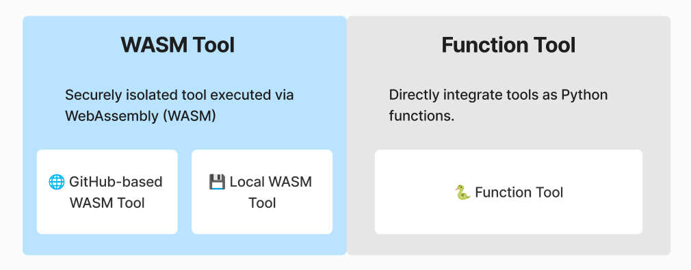

# What are tools?

## Why do AI Agents need tools?

Language models excel at processing and generating text, but they cannot independently fetch real-time data, communicate with external systems, or execute code. While they can reason and analyze information, they require external tools to interact with the digital world and take meaningful actions. Tools can solve this limitation.

With tools, AI models can extend their capabilities beyond text generation to:

- Fetching live data (e.g., retrieving stock prices, weather updates)
- Calling APIs (e.g., sending Slack messages, querying databases)
- Running local code (e.g., executing Python scripts, processing WASM code)
- Managing files (e.g., reading and writing to disk, handling cloud storage)

## How tool calling works

AI models with **tool-calling capabilities** can recognize when a tool is needed, select the appropriate tool, and execute it to fulfill a user’s request. Developers can design and integrate these tools, allowing AI models to take real-world actions.

- 🗣 **User:** “Can you check the latest issue for vessl-ai/hyperpocket?”
- 🤖 **AI Model’s Process:**
  1. Recognizes that live data is needed.
  2. Selects the appropriate tool (GitHub.GetIssue).
  3. Calls the tool, fetching the latest issue from GitHub.
  4. Generates a response using the retrieved data.

## How Hyperpocket handles tools

### Tool categorization by integration method



Hyperpocket provides two distinct ways to integrate tools into AI agents:

1. **WASM Tools** : Tools executed securely in an isolated WebAssembly (WASM) environment.
2. **Function Tools** : Lightweight Python functions that can be directly integrated into workflows.

#### WASM Tools

WASM tools are executed in secure, sandboxed environments, making them ideal for scenarios requiring high security and performance isolation. These tools can either be fetched from external repositories like GitHub or loaded directly from local storage.

WASM Tool has two following variants:

**Git-based Execution**

- Tools are fetched from a GitHub repository, downloaded locally, and executed via a WASM interpreter.
- This approach is useful for managed tools maintained by Hyperpocket or open-source contributions by the community.

**Local Execution**

- Pre-existing tools stored locally are executed directly using their file paths.
- Ideal for private tools or custom setups where internet access might be restricted.

```python
from hyperpocket.tool import from_git

# git-based execution
tool = from_git("https://github.com/vessl-ai/hyperpocket", "main", "managed-tools/slack/get-message")

# local execution
tool = from_local("yout/path/to/wasm/tool/in/local/env/slack/get-message")
```

The tool in the GitHub repository can be used by its URL directly.

```python
tool = from_git("https://github.com/vessl-ai/hyperpocket/tree/main/tools/slack/get-message")
```

#### Function Tools

Function Tools are lightweight, easy-to-implement tools that utilize Python functions decorated with a specific Hyperpocket interface. These tools are ideal for quick, inline tool development or rapid prototyping. To make Function Tool, the original function must have a docstring or implement `__doc__`.

```python
from hyperpocket.tool import function_tool

@function_tool
def get_weather(location: str) -> str:
    """
    Get the weather in a specific location.

    Args:
        location (str): The location to get the weather for.

    Returns:
        str: The weather in the specified location.
    """
    return f"The weather in {location} is sunny."
```

### Tool categorization by availability

#### Built-in Tools

Built-in tools are pre-installed and included in Hyperpocket to manage authentication sessions.

#### Public Tools (open-source)

Public tools are open-source and shared by the broader community, including individual contributors, other open-source projects, and Hyperpocket team as well. These tools can be hosted on various platforms such as Hyperpocket repository, other GitHub repositories and LangChain community, etc.

```python
from hyperpocket.tool import from_git

# managed by Hyperpocket Team
tool = from_git("https://github.com/vessl-ai/hyperpocket", "main", "slack/post-message")

# managed by community
tool = from_git("https://github.com/user/custom-tool-repo", "main", "community-tools/custom-task")
```

#### Your own tools

Custom tools are highly personalized tools that users can directly create and deploy in their local environments. These tools are fully managed by the user or their organization and can be implemented as inline functions or packaged modules. Users can execute them using either a local Python interpreter or a secure WASM interpreter, providing maximum flexibility for bespoke workflows.

```python
from hyperpocket.tool import function_tool, from_local

@function_tool
def custom_task():
		"""
		A custom inline function tool.
		"""

    return "This is my custom tool!"


tool = from_local(path="./local-tools/simple-echo-tool")
```

## Tool categories in a nutshell

### By integration method

| Integration Method     | Description                                                                                       | Catagory      |
| ---------------------- | ------------------------------------------------------------------------------------------------- | ------------- |
| Function               | Lightweight tools defined as Python functions and executed locally.                               | Function Tool |
| GitHub-based Execution | Tools fetched from GitHub repositories and executed in independent WASM runtime via interpreters. | WASM Tool     |
| Local Execution        | Tools stored locally and executed directly.                                                       | WASM Tool     |

### By availability

| Tool Type      | Category       | Description                                       | Operation by                                                               |
| -------------- | -------------- | ------------------------------------------------- | -------------------------------------------------------------------------- |
| Built-in Tools | Function       | Pre-installed tools ready for immediate use.      | Managed and predefined by Hyperpocket.                                     |
| Public Tools   | WASM, Function | Community-developed tools, officially maintained. | Developed by community.                                                    |
| Custom Tools   | WASM, Function | Personalized tools created and deployed by users. | Fully managed by the user, supporting inline and packaged implementations. |
