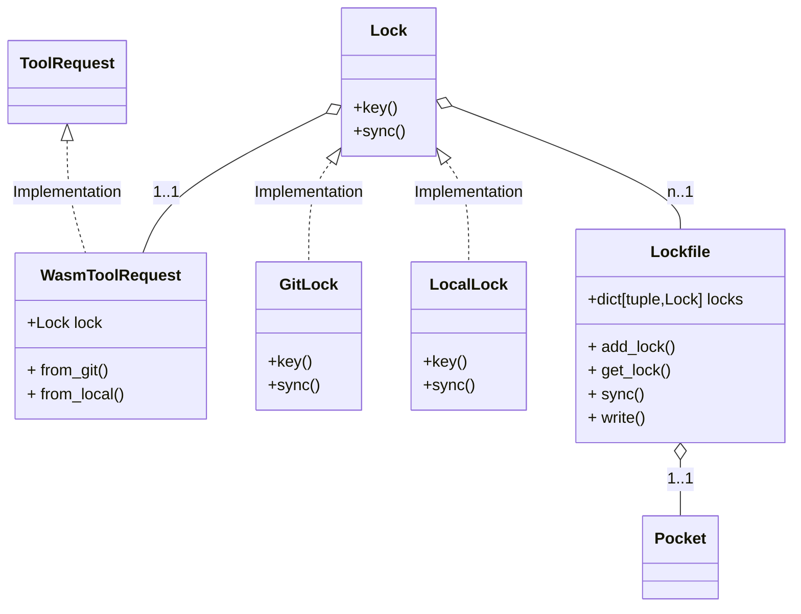
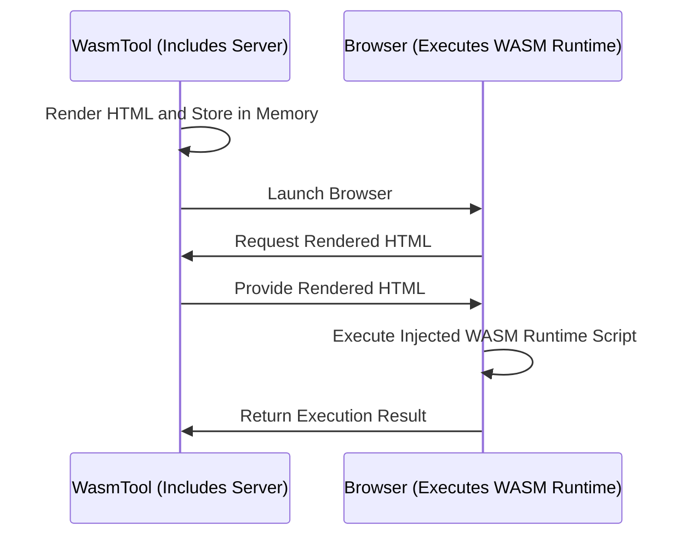

# Wasm(WebAssembly)

---

## How To Use

### plain url

load the tool by providing a GitHub URL

```python
from hyperpocket import Pocket

pocket = Pocket(tools=[
    'https://github.com/your-organization/your-repository/tree/main',
])
```

- in this case, read tool code from `main` branch by default

### from_git

- using `from_git`, you can specify branch and tool code path

```python
from hyperpocket import Pocket
from hyperpocket.tool import from_git

pocket = Pocket(tools=[
    from_git("https://github.com/your-organization/your-repository", "branch-name", "your/tool/code/path"),
])
```

### from_local

- using `from_local`, you can load a tool by specifying a local path

```python
from hyperpocket import Pocket
from hyperpocket.tool import from_local

pocket = Pocket(tools=[
    from_local("your/local/tool/code/path")
])
```

## WasmToolRequest

The class to initiate WasmTool

WasmToolRequest offer those build method:

- `from_local`
- `from_git`

Each `WasmToolRequest` has it's own `Lock` object

Those `Lock` object is managed by `Lockfile` in the `Pocket` class



### Inject tool variables

If the user specifies [tool_vars] in the `config.toml` of the tool's repository, which is allowed to be injected dynamically when the user develops an agent, it can be injected through the following steps.

```toml
# config.toml of a tool

[tool_vars]
config1 = "config1"
config2 = "config2"
```

1. Injecting tool_vars when importing tool in code.

```python
from_git('https://github.com/your-organization/your-repository/tree/main',tool_vars = {
    "config1": "modified_config1"
})
```

2. Injecting tool_vars by settings.toml
   Hyperpocket checks the `settings.toml` from the agent code directory.

## WasmTool

```python
class WasmTool(Tool):
    _invoker: WasmInvoker = None
    pkg_lock: Lock = None
    rel_path: str
    runtime: ScriptRuntime = None
    json_schema: Optional[dict] = None
    readme: Optional[str] = None
```

- `_invoker`: A class for executing WASM.
- `pkg_lock`: The lock class for the tool.
- Used for determining the package path where the current WASM code is stored.
- `rel_path`: The relative path to the location of the WASM code within the package.
- `runtime`: The runtime language of the WASM code.
- `json_schema`: The JSON schema for the WASM tool.
- Information read from schema.json.
- `readme`: The README information.

## WasmInvoker

A class for running actual WASM

1. Combines runtime information, authentication details, and body content to render HTML.
2. Stores the rendered HTML in memory.
3. Launches a browser to execute the WASM.
4. The browser sends a request to the server to retrieve the rendered HTML.
5. Executes code specific to each runtime within the HTML and returns the result.


