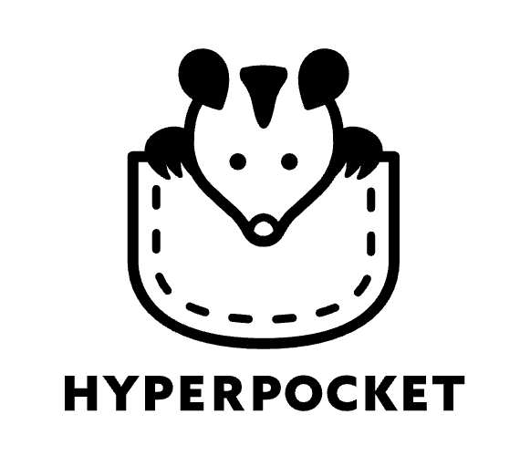

# Hyperpocket 👛

Hyperpocket is where tools belong. Power your agent up with a pocket of tools. 👛

<figure>

</figure>

## Introduction

Hyperpocket is a tool that allows you to easily use tool and auth for agents on your machine.

**_Start fast._** Just install Hyperpocket and use it. We know you don't have time to authenticate to our server.

**_Go securely._** Not like others, you are the only one who knows your secret tokens. We do NOT. All of your secret
tokens belong to your infrastructure, not ours.

**_Power up with public tools._** Without worries for tool integration, use others' tools just with copy-and-paste the
link to the tool. Your tool will run on isolated environment based on WebAssembly technology, and you don't have to deal
with the dependency spaghetti.

**_Battery Included_** You can use popular tools and authentication providers out-of-the-box.

## Installation

1. install hyperpocket

```bash
pip install hyperpocket
```

2. install playwright

```bash
playwright install
```

## Usage

Supported agent frameworks

- [x] Langgraph [link](https://www.langchain.com/langgraph)
- [x] Langchain [link](https://www.langchain.com/)
- [x] Llamaindex [link](https://www.llamaindex.ai/)

Or just use LLM API Clients out of the box.

- [x] OpenAI [link](https://openai.com/)
- [x] Anthropic [link](https://www.anthropic.com/)

### Using out-of-the-box tools

```python
from hyperpocket.tool import from_git
from langchain_openai import ChatOpenAI

from hyperpocket_langchain import PocketLangchain

pklc = PocketLangchain(
    tools=[
        from_git("https://github.com/vessl-ai/hyperawesometools", "main", "managed-tools/slack/get-message"),
        from_git("https://github.com/vessl-ai/hyperawesometools", "main", "managed-tools/slack/post-message"),
    ]
)
tools = pklc.get_tools()

llm = ChatOpenAI()
llm_tool_binding = llm.bind_tools(tools)
llm_tool_binding.invoke(...)
```

### Using out-of-the-box auth for various tools

There are two kinds of auth process, one is using system auth(developer api key) and the other is using end user auth.

Hyperpocket provides way to use end user auth easily.
(Of course, you can also just set your STRIPE_API_KEY when using Stripe API related tools)

- Supported methods

  - [x] OAuth
  - [x] Token
  - [ ] Basic Auth (Username, Password)

- Supported OAuth Providers
  - [x] Google
  - [x] GitHub
  - [x] Slack
  - [x] Linear
  - [ ] Facebook
  - [ ] X (Previously Twitter)
  - [ ] LinkedIn
  - [ ] Discord
  - [ ] Zoom
  - [ ] Microsoft
  - [ ] Spotify
  - [ ] Twitch

You can manage your auths in request-wise level. (e.g. you can use different auths for different requests)

```python
from hyperpocket.tool import from_git
from langchain_openai import ChatOpenAI
from langgraph.graph import StateGraph, START, MessagesState
from langgraph.prebuilt import tools_condition

from hyperpocket_langgraph import PocketLanggraph

pklg = PocketLanggraph(
    tools=[
        from_git("https://github.com/vessl-ai/hyperawesometools", "main", "managed-tools/slack/get-message"),
        from_git("https://github.com/vessl-ai/hyperawesometools", "main", "managed-tools/slack/post-message"),
    ],
)
llm = ChatOpenAI()

# Langgraph
pk_tool_node = pklg.get_tool_node()
llm_tool_binding = llm.bind_tools(pklg.get_tools())

# ...

graph_builder = StateGraph(MessagesState)

graph_builder.add_node('llm', llm)
graph_builder.add_node('tools', pk_tool_node)
graph_builder.add_edge(START, llm)
graph_builder.add_conditional_edges("llm", tools_condition)
graph_builder.add_edge(pk_tool_node, llm)

# ...

graph_builder.compile()

```

```python
from hyperpocket.config import secret
from hyperpocket.tool import from_git
from llama_index.core.agent import FunctionCallingAgent
from llama_index.llms.openai import OpenAI

from hyperpocket_llamaindex import PocketLlamaindex

llm = OpenAI(api_key=secret["OPENAI_API_KEY"])
pocket = PocketLlamaindex(
    tools=[
        from_git("https://github.com/vessl-ai/hyperawesometools", "main", "managed-tools/slack/get-message"),
        from_git("https://github.com/vessl-ai/hyperawesometools", "main", "managed-tools/slack/post-message"),
        from_git("https://github.com/vessl-ai/hyperawesometools", "main", "managed-tools/linear/get-issues"),
        from_git("https://github.com/vessl-ai/hyperawesometools", "main", "managed-tools/google/get-calendar-events"),
        from_git("https://github.com/vessl-ai/hyperawesometools", "main", "managed-tools/google/get-calendar-list"),
    ]
)
tools = pocket.get_tools()

agent = FunctionCallingAgent.from_tools(tools=tools, llm=llm)
```

### Specifying auth methods for tool type

Some resources support multiple auth methods. Your end user should be able to select between those methods.

```text
Human: List my slack messages in 'general' channel

Assistance: To access your slack messages, you need authentication. Slack api provides 1) bot token auth 2) OAuth auth. Which do you want to proceed?

Human: I'll go with OAuth

Assistance: You need chat:read, channel:history scopes to list messages. Do you confirm?

Human: OK.

Assistance: Please proceed to the following url and finish authentication. After that, let me know.
> https://slack.com/authorize?clientId=xxx&scope=chat:read,channel:history&redirect_url=xxx

Human: I'm done. (if necessary)

Assistance: I've checked you finished your auth. Let me search messages in slack channel 'general'.

Assistance: Here are the recent 10 messages.
(...)


```

### Config

The `settings.toml` looks as follows.

```toml
log_level = "debug"
internal_server_port = "8000" # optional, default is 8000
public_hostname = "localhost" # optional, default is localhost
public_server_protocol = "https" # optional, default is https
public_server_port = "8001" # optional, default is 8001
enable_local_callback_proxy = "true" # optional, default is true, can be turned off when running in production behind TLS termination
callback_url_rewrite_prefix = "proxy" # optional, default is proxy, auth callback url prefix

[session]
session_type = "redis" # optional, default is in-memory
[session.redis]
host = "localhost"
port = 6379
db = 0

[git]
[git.github]
github_token = "<Your github PAT>" # optional, your github personal access token
app_id = "<Your github app id>" # optional, your github app id
app_installation_id = "<Your github app installation id>" # optional, your github app installation id
app_private_key = "<Your github app private key>" # optional, your github app private key

[auth]
[auth.slack] # add your slack app's client id and secret for slack auth
client_id = "" # your slack client id
client_secret = "" # your slack client secret

[auth.github] # add your github app's client id and secret for github auth
client_id = "" # your github client id
client_secret = ""  # your github client secret
```

#### How to integrate github OAuth app

1. Follow the github documentation to create a new OAuth
   app. https://docs.github.com/en/apps/oauth-apps/building-oauth-apps/creating-an-oauth-app

- While creating your github OAuth app, configuring your app's `Authorization callback URL` is different for your
  development environment and production environment.
  - For development environment, you can use `http://localhost:8000/auth/github/callback`
    - **Note**: Default port for hyperpocket dev server is `8000`. If you are using a different port, make sure to
      replace `8000` with your actual port number.
  - For production environment, you can use `https://yourdomain.com/auth/github/callback`
    - **Note**: Make sure to replace `yourdomain.com` with your actual domain name that this app will be hosted on.

#### How to integrate SLACK OAuth app

1. Follow the slack documentation to create a new Oauth APP. https://api.slack.com/quickstart

2. Setting Redirect URLs, Scopes at OAuth & Permissions tap in slack APP page

- Redirect URLs :
  `{public_server_protocol}://{public_hostname}:[{public_server_port}]/{callback_url_rewrite_prefix}/auth/slack/oauth2/callback`
- Scopes : What you want to request to user.
  - Recommended scopes :
    - channels:history,
    - channels:read,
    - chat:write,
    - groups:history,
    - groups:read,
    - im:history,
    - mpim:history,
    - reactions:read,
    - reactions:write,

3. Set your Slack APP Client ID / Client Secret in `$HOME/.pocket/settings.toml`

#### How to start adding a new token auth

1. Generate boilerplate codes for token-based auth services ?

```
# service_name should be lowercase including underscore
poetry run hyperpocket devtool create-token-auth-template {service_name}
```

It will generate boilerplate code lines for a new token-based auth service

2. Extend AuthProvider enum to add your new auth provider.

```python
class AuthProvider(Enum):
SERVICE = 'service'
```

3. Specify auth provider for tools

1) github repo or local

```toml
[auth]
auth_provider = "{service_name}"
auth_handler = "{service_name}-token"
scopes = []
```

2. function_tool

```python
@function_tool(
    auth_provider=AuthProvider.SERVICE
)
def my_function(**kwargs):
```
