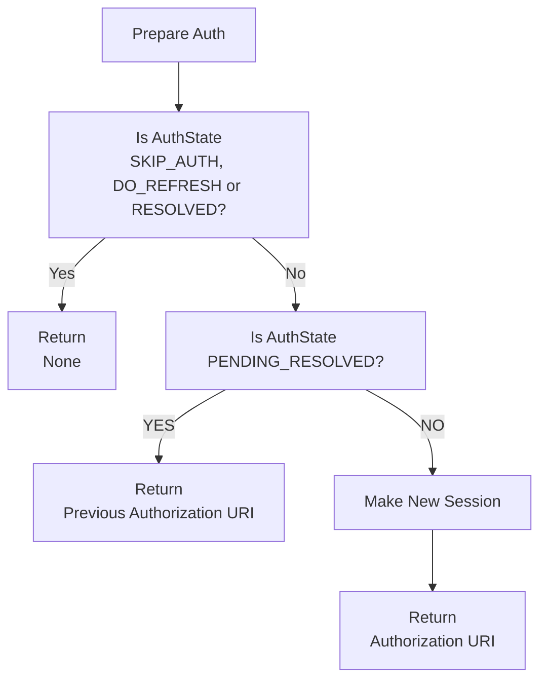
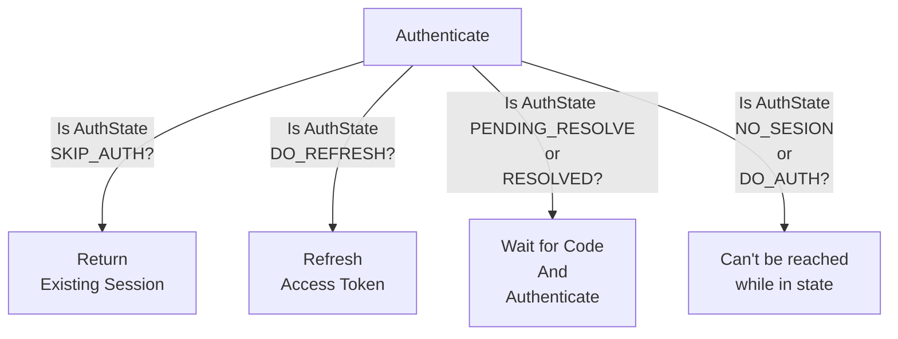

## Auth

각 provider에서 유저를 식별하기 위한 프로세스

### AuthContext

실제 유저의 인증 정보(e.g., access token)을 담고 있는 객체

```python
class AuthContext(BaseModel, ABC):
    """
    This class is used to define the interface of the authentication model.
    """
    access_token: str = Field(description="user's access token")
    description: str = Field(description="description of this authentication context")
    expires_at: Optional[datetime] = Field(description="expiration datetime")
    detail: Optional[Any] = Field(default=None, description="detailed information")
```

일반적으로 해당 객체에서 access token의 key 정보나 response 객체를 AuthContext로 변환해주는 역할을 수행한다.

### AuthenticateRequest

authentication 수행 시에 필요한 정보를 담고 있는 객체

```python
class AuthenticateRequest(BaseModel):
    auth_scopes: Optional[list[str]] = Field(default_factory=list,
                                             description="authentication scopes. if the authentication handler is non scoped, it isn't needed")
```

- 일반적으로 인증 시에 필요한 client id 및 secret id 등과 같은 정보를 request에 같이 전달한다.

**examples**

```python
class GitHubOAuth2Request(AuthenticateRequest):
    client_id: str
    client_secret: str
```

### AuthenticateResponse(Optional)

authentication response에서 필수 정보를 담고 있는 객체

```python
class AuthenticateResponse(BaseModel):
    """
    This class is used to define the interface of the authentication response.
    """
    pass
```

- handler에서 response를 dict 형태로 처리한다면, 구현할 필요가 없다.

### AuthHandlerInterface

실제 authentication을 수행하는 객체

```python
class AuthHandlerInterface(ABC):
    name: str = Field(description="name of the authentication handler")
    description: str = Field(description="description of the authentication handler")
    scoped: bool = Field(description="Indicates whether the handler requires an auth_scope for access control")
    

    @staticmethod
    def provider() -> AuthProvider:
        """
        Returns the authentication provider enum.

        This method is used to determine the appropriate authentication handler
        based on the authentication provider.
        """
        raise NotImplementedError()

    @staticmethod
    def provider_default() -> bool:
        """
        Indicates whether this authentication handler is the default handler.

        If no specific handler is designated, the default handler will be used.

        Returns:
            bool: True if this handler is the default, False otherwise.
        """
        return False

    @staticmethod
    def recommended_scopes() -> set[str]:
        """
        Returns the recommended authentication scopes.

        If `use_recommended_scope` is set to True in the `AuthConfig`,
        this method should return the proper recommended scopes. Otherwise,
        it should return an empty set.

        Returns:
            set[str]: A set of recommended scopes, or an empty set if not applicable.

        Examples:
            Slack OAuth2 recommended_scopes::

                def recommended_scopes() -> set[str]:
                    if config.auth.slack.use_recommended_scope:
                        recommended_scopes = {
                            "channels:history",
                            "channels:read",
                            "chat:write",
                            "groups:history",
                            "groups:read",
                            "im:history",
                            "mpim:history",
                            "reactions:read",
                            "reactions:write",
                        }
                    else:
                        recommended_scopes = {}
                    return recommended_scopes
        """
        raise NotImplementedError()

    def make_request(self, auth_scopes: Optional[list[str]] = None, **kwargs) -> AuthenticateRequest:
        """
        Make an AuthenticationRequest.

        Usually, this method only requires `auth_scopes`.
        If additional static information is needed (e.g., clientID, secretID),
        retrieve it from the configuration.

        Args:
            auth_scopes (Optional[list[str]]): list of auth scopes

        Returns:
            AuthenticateRequest: A authentication request object with the necessary details.

        Examples:
            Create a Slack OAuth2 request::

                def make_request(self, auth_scopes: Optional[list[str]] = None, **kwargs) -> SlackOAuth2Request:
                    return SlackOAuth2Request(
                        auth_scopes=auth_scopes,
                        client_id=config.auth.slack.client_id,
                        client_secret=config.auth.slack.client_secret
                    )
        """
        raise NotImplementedError()

    def prepare(self, auth_req: AuthenticateRequest, thread_id: str, profile: str,
                future_uid: str, *args, **kwargs) -> str:
        """
        Performs preliminary tasks required for authentication.

        This method typically performs the following actions:
        - Creates a future to wait for user authentication completion during the authentication process.
        - Issues an authentication URI that the user can access.

        Args:
            auth_req (AuthenticateRequest): The authentication request object.
            thread_id (str): The thread ID.
            profile (str): The profile name.
            future_uid (str): A unique identifier for each future.

        Returns:
            str: The authentication URI that the user can access.
        """
        raise NotImplementedError()

    @abstractmethod
    async def authenticate(self, auth_req: AuthenticateRequest, future_uid: str, *args, **kwargs) -> AuthContext:
        """
        Performs the actual authentication process.

        This function assumes that the user has completed the authentication during the `prepare` step,
        and the associated future has been resolved. At this point, the result contains the required
        values for authentication (e.g., an auth code).

        Typically, this process involves:
        - Accessing the resolved future to retrieve the necessary values for authentication.
        - Performing the actual authentication using these values.
        - Converting the returned response into an appropriate `AuthContext` object and returning it.

        Args:
            auth_req (AuthenticateRequest): The authentication request object.
            future_uid (str): A unique identifier for the future, used to retrieve the correct
                              result issued during the `prepare` step.

        Returns:
            AuthContext: The authentication context object containing the authentication result.
        """
        raise NotImplementedError()

    @abstractmethod
    async def refresh(self, auth_req: AuthenticateRequest, context: AuthContext, *args, **kwargs) -> AuthContext:
        """
        Performs re-authentication for an expired session.

        This method is optional and does not need to be implemented for handlers that do not require re-authentication.

        Typically, the information needed for re-authentication (e.g., a refresh token) should be stored
        within the `AuthContext` during the previous authentication step.
        In the `refresh` step, this method accesses the necessary re-authentication details from the provided `context`,
        performs the re-authentication, and returns an updated `AuthContext`.

        Args:
            auth_req (AuthenticateRequest): The authentication request object.
            context (AuthContext): The current authentication context that it should contain data required for re-authentication.

        Returns:
            AuthContext: An updated authentication context object.
        """
        raise NotImplementedError()
```

## How To Implement Auth

1. `AuthenticateRequest`을 상속받은 구현체 구현
    - 해당 클래스에서는 실제 prepare 및 authenticate를 할 때 필요한 정보를 저장하고 있어야 합니다.

2. `AuthContext`을 상속받은 구현체 구현
    - Context 내에는 다음과 같은 정보들이 존재해야 합니다.
    - 각 tool에서 접근할 수 있는 access_key
    - response를 context로 변환할 수 있는 함수

3. `Response`(Optional) 객체 구현
    - 필요시 authentication을 완료 후 받은 정보를 parsing할 구현체를 구현

4. `AuthHandlerInterface`을 상속받은 구현체 구현
    - 실제 prepare, authentication, refresh를 수행할 객체를 구현합니다.

5. (신규 auth provider인 경우) `AuthProvider`에 새로운 enum value를 추가
    - 만약 새로운 `AuthProvider`가 추가되는 경우라면, `hyperpocket/auth/provider.py` 내에 새로운 AuthProvider Enum을 등록해야 합니다.

6. 신규 Auth callback server enpoint 추가
    - `hyperpocket/server/auth/` 하위에 유저가 authentication을 완료하면 callback될 server endpoint를 추가해야 합니다.
    - 해당 패키지 하위에 적절한 `APIRouter`를 선언해놓으면 pocket 초기화 시에 자동으로 end point를 pocket server에 등록해주게 됩니다.

7. Auth Test code 추가(Optional)
    - `hyperpocket/auth/tests` 하위에 테스트 코드 추가

---

## Auth Flow(Advanced)

### Session State 정의

- SKIP_AUTH : Auth가 존재하고, 들어온 요청에 대한 권한도 가지고 있는 상태
- DO_AUTH : Auth가 존재하지만, 들어온 요청에 대한 권한이 없기 때문에 auth가 필요한 상태
- DO_REFRESH : Auth가 존재하지만, 만료가 되어 refresh가 필요한 상태
- NO_SESSION : Auth가 존재하지 않는 상태
- PENDING_RESOLVE : Resource Owner에게 authorization URI를 전달하고 인증을 기다리는 상태
- RESOLVED : Resource Owner가 authorization을 완료해 서버에서 code를 받은 상태

### 01. check

처음 요청이 들어왔을 때 현재 사용자의 session이 어느 상태인지를 check하게 된다.

1. 사용자의 현재 session 조회
    - 존재 하지 않으면 NO_SESSION 상태 반환
2. session의 auth resolve uid가 존재하는지 확인
    - auth resolve uid가 아직 존재하는 것은 사용자에게 authentication URI는 전달하였지만 서버에서 access token을 아직 얻지는 못 한 상태
    - auth resolve uid가 존재하면서 현재 사용자가 인증을 완료한 상태인지 확인
        - 사용자가 인증을 완료한 상태라면 RESOLVED 상태 반환
        - 사용자가 인증을 완료하지 못 한 상태라면 PENDING_RESOLVE 상태 반환
3. 현재 인증된 session이 현재 요청에 적용이 가능한지를 확인
    - 현재 session의 auth provider와 필요한 session의 auth provider가 동일한지를 확인
        - 다르다면 반드시 재인증이 필요
    - 현재 session을 인증한 auto provider가 non scoped인지 확인
        - scoped가 아닌 경우에는 모든 권한이 있기 때문에 항상 사용 가능
    - scoped인 경우 필요한 scope을 이미 가지고 있는지 확인
        - 이미 가지고 있는 경우 그대로 사용하면 된다.
        - 가지고 있지 않은 경우 새로운 인증 요청이 필요. 이때 기존 갖고 있던 scope과 새로 필요한 scope의 합집합을 다시 요청하게 된다.
    - 위 과정을 통해 현재 session에서 적용이 불가능 하다고 판단되면 DO_AUTH 상태 반환
4. 현재 인증된 session이 만료되었는지 확인
    - 만료되었다면 DO_REFRESH 상태 반환
5. 위 단계를 모두 통과한 경우에만 SKIP_AUTH 상태 반환

### 02. prepare

1. auth state가 SKIP_AUTH, DO_REFRESH, RESOLVED인 경우에는 그대로 함수를 종료
2. DO_AUTH, NO_SESSION인 경우에는 새로운 session과 future를 만들고, 사용자에게 authenticate URI를 반환
3. PENDING_RESOLVED인 경우에는 기존 session의 authenticate URI를 다시 반환



### 03. Authenticate

1. auth state가 SKIP_AUTH인 경우에는 기존 session을 그대로 반환
2. auth state가 DO_REFRESH인 경우에는 refresh를 수행하고 기존 session을 교체
3. auth state가 PENDING_RESOLVE 또는 RESOLVED인 경우에는 사용자로부터 전달받은 code로 authenticate를 수행
4. 그 외 auth state(NO_SESSION, DO_AUTH)는 해당 단계로 진입하지 않는다.



