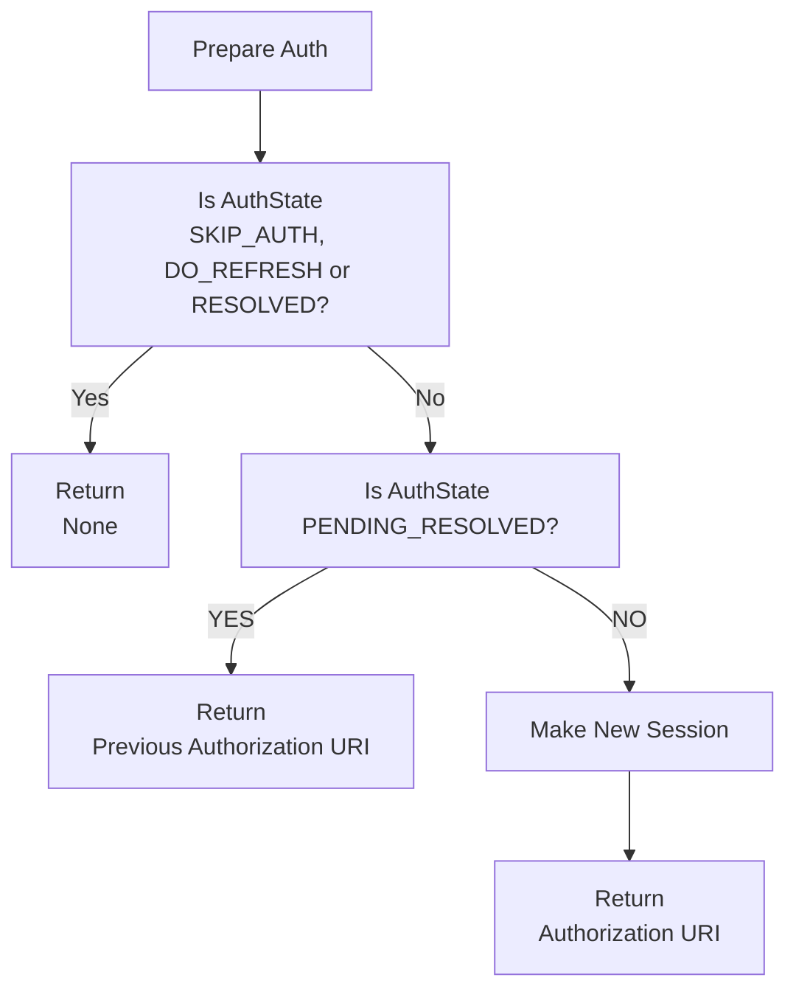
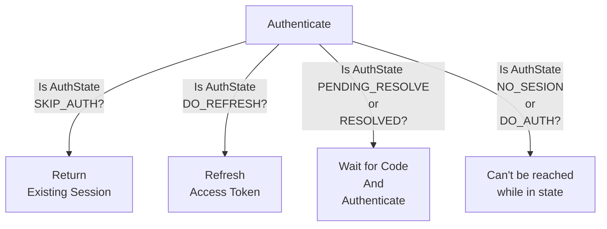

# Auth

A Process to identify users for each provider.

---

## Interface

### AuthContext

An object containing the actual authentication information of the user (e.g., access token).

```python
class AuthContext(BaseModel, ABC):
    """
    This class is used to define the interface of the authentication model.
    """
    access_token: str = Field(description="user's access token")
    description: str = Field(description="description of this authentication context")
    expires_at: Optional[datetime] = Field(description="expiration datetime")
    detail: Optional[Any] = Field(default=None, description="detailed information")
```

- The primary purpose of this object is to transform key details, such as the access token or response object, into an
  AuthContext.

### AuthenticateRequest

An object containing the necessary information to perform authentication.

```python
class AuthenticateRequest(BaseModel):
    auth_scopes: Optional[list[str]] = Field(
        default_factory=list,
        description="authentication scopes. if the authentication handler is non scoped, it isn't needed")
```

- Typically, this object also includes information like client ID and secret ID required for authentication

**examples**

```python
class GitHubOAuth2Request(AuthenticateRequest):
    client_id: str
    client_secret: str
```

### AuthenticateResponse(Optional)

An object containing the necessary information from authentication response.

```python
class AuthenticateResponse(BaseModel):
    """
    This class is used to define the interface of the authentication response.
    """
    pass
```

- If the response is handled as dict in handler, don't have to implement this.

### AuthHandlerInterface

An interface for the object that performs the actual authentication process.

```python
class AuthHandlerInterface(ABC):
   name: str = Field(description="name of the authentication handler")
   description: str = Field(description="description of the authentication handler")
   scoped: bool = Field(description="Indicates whether the handler requires an auth_scope for access control")
    
   @staticmethod
   def provider() -> AuthProvider:
      """
      Returns the authentication provider enum.

      This method is used to determine the appropriate authentication handler
      based on the authentication provider.
      """
      raise NotImplementedError()

   @staticmethod
   def provider_default() -> bool:
      """
      Indicates whether this authentication handler is the default handler.

      If no specific handler is designated, the default handler will be used.

      Returns:
          bool: True if this handler is the default, False otherwise.
      """
      return False

   @staticmethod
   def recommended_scopes() -> set[str]:
      """
      Returns the recommended authentication scopes.

      If `use_recommended_scope` is set to True in the `AuthConfig`,
      this method should return the proper recommended scopes. Otherwise,
      it should return an empty set.

      Returns:
          set[str]: A set of recommended scopes, or an empty set if not applicable.

      Examples:
          Slack OAuth2 recommended_scopes::

              def recommended_scopes() -> set[str]:
                  if config.auth.slack.use_recommended_scope:
                      recommended_scopes = {
                          "channels:history",
                          "channels:read",
                          "chat:write",
                          "groups:history",
                          "groups:read",
                          "im:history",
                          "mpim:history",
                          "reactions:read",
                          "reactions:write",
                      }
                  else:
                      recommended_scopes = {}
                  return recommended_scopes
      """
      raise NotImplementedError()

   def make_request(self, auth_scopes: Optional[list[str]] = None, **kwargs) -> AuthenticateRequest:
      """
      Make an AuthenticationRequest.

      Usually, this method only requires `auth_scopes`.
      If additional static information is needed (e.g., clientID, secretID),
      retrieve it from the configuration.

      Args:
          auth_scopes (Optional[list[str]]): list of auth scopes

      Returns:
          AuthenticateRequest: A authentication request object with the necessary details.

      Examples:
          Create a Slack OAuth2 request::

              def make_request(self, auth_scopes: Optional[list[str]] = None, **kwargs) -> SlackOAuth2Request:
                  return SlackOAuth2Request(
                      auth_scopes=auth_scopes,
                      client_id=config.auth.slack.client_id,
                      client_secret=config.auth.slack.client_secret
                  )
      """
      raise NotImplementedError()

   def prepare(self, auth_req: AuthenticateRequest, thread_id: str, profile: str,
               future_uid: str, *args, **kwargs) -> str:
      """
      Performs preliminary tasks required for authentication.

      This method typically performs the following actions:
      - Creates a future to wait for user authentication completion during the authentication process.
      - Issues an authentication URI that the user can access.

      Args:
          auth_req (AuthenticateRequest): The authentication request object.
          thread_id (str): The thread ID.
          profile (str): The profile name.
          future_uid (str): A unique identifier for each future.

      Returns:
          str: The authentication URI that the user can access.
      """
      raise NotImplementedError()

   @abstractmethod
   async def authenticate(self, auth_req: AuthenticateRequest, future_uid: str, *args, **kwargs) -> AuthContext:
      """
      Performs the actual authentication process.

      This function assumes that the user has completed the authentication during the `prepare` step,
      and the associated future has been resolved. At this point, the result contains the required
      values for authentication (e.g., an auth code).

      Typically, this process involves:
      - Accessing the resolved future to retrieve the necessary values for authentication.
      - Performing the actual authentication using these values.
      - Converting the returned response into an appropriate `AuthContext` object and returning it.

      Args:
          auth_req (AuthenticateRequest): The authentication request object.
          future_uid (str): A unique identifier for the future, used to retrieve the correct
                            result issued during the `prepare` step.

      Returns:
          AuthContext: The authentication context object containing the authentication result.
      """
      raise NotImplementedError()

   @abstractmethod
   async def refresh(self, auth_req: AuthenticateRequest, context: AuthContext, *args, **kwargs) -> AuthContext:
      """
      Performs re-authentication for an expired session.

      This method is optional and does not need to be implemented for handlers that do not require re-authentication.

      Typically, the information needed for re-authentication (e.g., a refresh token) should be stored
      within the `AuthContext` during the previous authentication step.
      In the `refresh` step, this method accesses the necessary re-authentication details from the provided `context`,
      performs the re-authentication, and returns an updated `AuthContext`.

      Args:
          auth_req (AuthenticateRequest): The authentication request object.
          context (AuthContext): The current authentication context that it should contain data required for re-authentication.

      Returns:
          AuthContext: An updated authentication context object.
      """
      raise NotImplementedError()
```

---

## How To Implement Auth

1. Implement a class that inherits `AuthenticateRequest`
    - This class should store the necessary information for the prepare and authenticate steps.

2. Implement a class that inherits `AuthContext`
    - This Context should include:
        - The access key that tools can access.
        - A function to convert a response into an `AuthContext`

3. Optionally, implement a `Response` class
    - This class can parse the response data received after completing authentication.

4. Implement a class that inherits `AuthHandlerInterface`
    - This class perform the actual prepare, authenticate, and refresh steps.

5. Add a new enum value to the `AuthProvider` Enum(only implement new auth provider)
    - If a new `AuthProvider` is added, update the `AuthProvider` enum in `hyperpocket/auth/provider.py`

6. Add new auth callback server endpoint
    - Add the endpoint under `hyperpocket/server/auth/` packages.
    - Declare an appropriate `APIRouter` in the package. Pocket will automatically register the endpoint during
      initialization.

7. Add test code(optional)
    - Add the test code under `hyperpocket/auth/tests/` packages.

---

## Auth Flow(Advanced)

### Session States

- SKIP_AUTH: The authentication exists, and the request has the necessary permissions.

- DO_AUTH: Authentication exists, but the request requires additional permissions.

- DO_REFRESH: Authentication exists but has expired, requiring a refresh.

- NO_SESSION: No authentication exists.

- PENDING_RESOLVE: Waiting for the user to complete the authentication process via the authorization URI.

- RESOLVED: The user has completed authentication, and the server has received the authorization code.

### 01. check

Determines the current session state when a request is received.

1. Check if a session exists.
    - If not, return NO_SESSION.

2. Check for an auth resolve uid.
    - If it exists but authentication isn’t complete, return PENDING_RESOLVE.
    - If completed, return RESOLVED.

3. Check if the session is valid for the request:
    - Compare the auth provider.
    - Validate scopes (for scoped providers).
    - If the session doesn’t satisfy requirements, return DO_AUTH.

4. Check if the session has expired.
    - If expired, return DO_REFRESH.

5. If all checks pass, return SKIP_AUTH.

### 02. prepare

1. If the auth state is SKIP_AUTH, DO_REFRESH, or RESOLVED, do nothing.

2. If the auth state is DO_AUTH or NO_SESSION:
    - Create a new session and future.
    - Return the authorization URI.

3. If the state is PENDING_RESOLVE, return the existing authorization URI.



### 03. Authenticate

1. If the auth state is SKIP_AUTH, return the existing session.
2. If the state is DO_REFRESH, refresh the session.
3. If the state is PENDING_RESOLVE or RESOLVED, perform authentication using the authorization code.
4. If the state is NO_SESSION or DO_AUTH, this step should not be reached.



