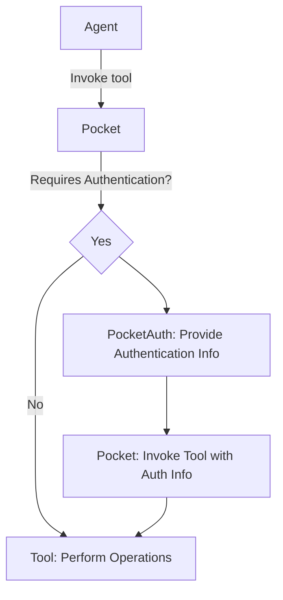

# Tool

---

## ToolRequest

각 Tool을 초기화할 때 필요한 정보를 담고 있는 인터페이스

## ToolAuth

ToolAuth는 Tool을 호출하기 위해 필요한 Authentication 정보를 나타내는 객체

다음과 같은 필드가 존재

- auth_provider : tool 호출 시에 어떤 authentication provider의 인증 정보가 필요한지 표시
    - auth_provider가 명시되지 않는 경우, authentication이 필요없는 Tool로 인식된다.
- auth_handler : tool 호출 시 어떤 authentication handler를 사용할 것인지를 표시
    - auth_handler가 명시되지 않는 경우, authentication provider의 default handler가 사용된다.
- scopes : tool 호출 시에 어떤 authentication scopes가 필요한지를 표시
    - authentication을 수행하지 않거나, authentication handler가 non-scoped인 경우에는 None값을 사용

## Tool

실제 Tool을 실행하는 인터페이스

```python
class Tool(BaseModel, abc.ABC):
    name: str = Field(description="tool name")
    description: str = Field(description="tool description")
    argument_json_schema: Optional[dict] = Field(default=None, description="tool argument json schema")
    auth: Optional[ToolAuth] = Field(default=None, description="authentication information to invoke tool")
```

### schema_model

Tool.schema_model은 Tool이 호출 될 때 인자로 `profile`과 `thread_id`를 받기 위해 기존 Tool의 argument_json_schema을 wrapping한
model을 반환

이때 기존의 argument_json_schema는 `body` 필드로 이동

## How to implement

1. Tool을 상속한 클래스를 생성
    - `invoke` 또는 `ainvoke` 내에서 툴 호출 시 수행할 작업을 정의
    - Tool을 초기화할 factory method를 정의
        - 이때 위의 필수 필드에 대한 값을 주입

2. `Pocket` 내의 `ToolLike`에 클래스를 추가(Optional)
    - `WasmTool`의 경우 ToolRequest, str을 입력으로 받을 수 있음
    - `FunctionTool`의 경우 Callable을 입력으로 받을 수 있음

3. `Pocket.__init__` 또는 `Pocket._load_tool` 함수 내에서 `ToolLike`값을 기반으로 Tool 초기화 수행

## Invoke Flow

1. `Pocket.invoke`를 통해 최초 Tool calling이 수행된다.
2. Tool 호출을 위해 authentication이 필요한 경우 `PocketAuth.invoke`를 통해 authentication을 수행
3. authentication이 완료된 후 `PocketAuth`에서 얻은 authentication 정보를 tool 호출 시 같이 전달


