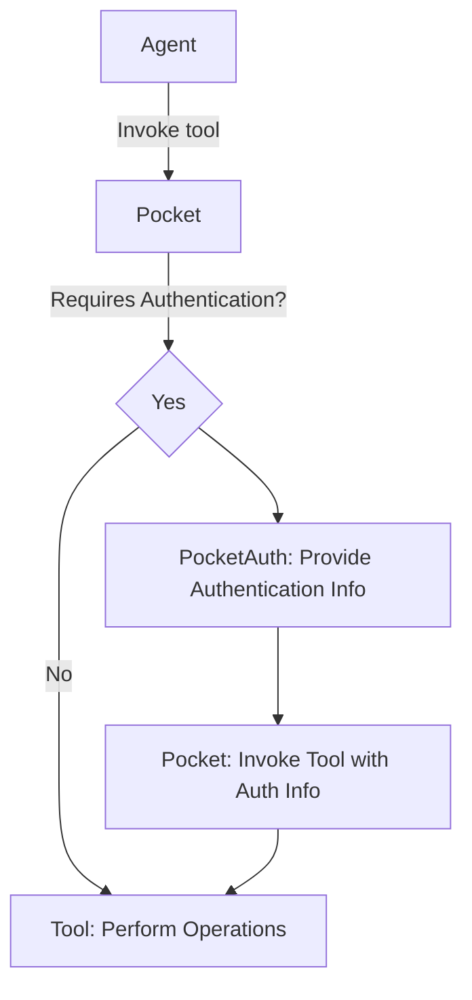

# Tool

---

## ToolRequest

The interface that contains information to initiate each tool

## ToolAuth

The class that contains authentication information to invoke tool

authentication information fields are:

- `auth_provider`: Indicates which authentication provider’s credentials are required to invoke the tool.

  - If auth_provider is not specified, the tool is considered to require no authentication.

- `auth_handler`: Specifies which authentication handler should be used when invoking the tool.

  - If auth_handler is not specified, the default handler of the authentication provider will be used.

- `scopes`: Indicates the authentication scopes required to invoke the tool.
  - If authentication is not performed or the authentication handler is non-scoped, the value should be None.

## Tool

The interface to execute tool actually

```python
class Tool(BaseModel, abc.ABC):
    name: str = Field(description="tool name")
    description: str = Field(description="tool description")
    argument_json_schema: Optional[dict] = Field(default=None, description="tool argument json schema")
    auth: Optional[ToolAuth] = Field(default=None, description="authentication information to invoke tool")
    postprocessings: Optional[list[Callable]] = Field(default=None, description="postprocessing functions after tool is invoked")
    default_tool_vars: dict[str, str] = Field(default_factory=dict, description="default tool variables")
    overridden_tool_vars: dict[str, str] = Field(default_factory=dict, description="overridden tool variables")
```

### schema_model

`Tool.schema_model` returns a model that wraps the existing `argument_json_schema` to include `profile` and `thread_id` as
arguments when the tool is invoked.

In this process, the original `argument_json_schema` is moved under the `body` field.

## How to implement

1. Create a class that inherits from Tool

   - Define the tasks to be performed when invoking the tool in invoke or ainvoke.
   - Define a factory method to initialize the tool.(Optional)
   - Inject values for the required fields during initialization.

2. Add the class to `ToolLike` in Pocket (Optional)

   - For `WasmTool`, the input can be a ToolRequest or a str.
   - For `FunctionTool`, the input can be a Callable.

3. Perform tool initialization in `Pocket.__init__` or `Pocket._load_tool`
   - The initialization is based on the provided ToolLike value.

## Invoke Flow

1. The initial tool invocation occurs via `Pocket.invoke`.
2. If authentication is required for tool invocation, authentication is performed using `PocketAuth.invoke`.
3. After successful authentication, the authentication information obtained from PocketAuth is included when invoking
   the tool.


