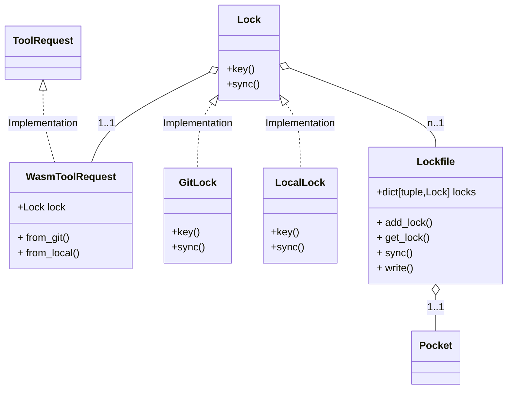
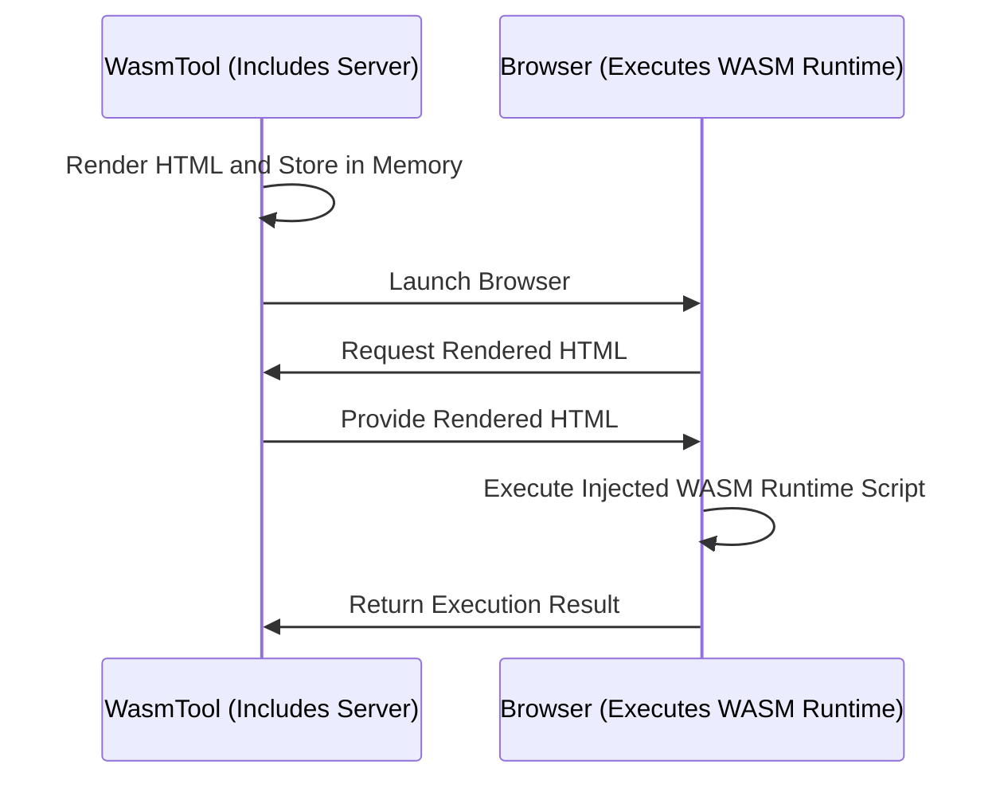

# Wasm(WebAssembly)

---

## How To Use

### plain url

`Pocket` 초기화 시 github url을 넣어서 해당 툴을 불러올 수 있다.

```python
from hyperpocket import Pocket

pocket = Pocket(tools=[
    'https://github.com/your-organization/your-repository/tree/main',
])
```

- 이 경우 기본적으로 `main` branch를 기준으로 코드를 읽어오게 된다.

### from_git

`from_git`을 통해 명시적으로 branch나 경로를 지정해 툴을 불러올 수 있다.

```python
from hyperpocket import Pocket
from hyperpocket.tool import from_git

pocket = Pocket(tools=[
    from_git("https://github.com/your-organization/your-repository", "branch-name", "your/tool/code/path"),
])
```

### from_local

`from_local`을 통해 로컬 경로를 지정해 툴을 불러올 수 있다.

```python
from hyperpocket import Pocket
from hyperpocket.tool import from_local

pocket = Pocket(tools=[
    from_local("your/local/tool/code/path")
])
```

## WasmToolRequest

WasmTool을 초기화 하기 위한 객체

WasmToolRequest는 다음 build 함수를 제공

- `from_local`
- `from_git`
- `from_github`

WasmToolRequest는 각각 request에 대한 `lock` 객체를 가지고 있다.

해당 `lock` 객체들은 `Pocket`에서 `Lockfile` 객체를 통해 관리된다.



## WasmTool

```python
class WasmTool(Tool):
    _invoker: WasmInvoker = None
    pkg_lock: Lock = None
    rel_path: str
    runtime: ScriptRuntime = None
    json_schema: Optional[dict] = None
    readme: Optional[str] = None
```

- `_invoker` : wasm을 실행시키기 위한 클래스
- `pkg_lock` : 해당 Tool의 lock 클래스
    - pkg_lock을 통해 현재 wasm code가 저장되어 있는 패키지 경로를 확인
- `rel_path` : package 내에서 wasm code가 존재하는 상대 위치
- `runtime` : wasm code의 runtime 언어
- `json_schema` : wasm tool의 json schema
    - `schema.json`로 읽어온 정보
- `readme` : readme 정보

## WasmInvoker

실제 wasm을 구동하기 위한 클래스

1. runtime 정보, auth 정보, body 정보 등을 종합해 html을 rendering
2. rendering된 html을 메모리에 저장
3. wasm 실행을 위한 browser를 실행
4. browser에서는 서버로 요청을 보내 rendering된 html을 불러옴
5. 해당 html에서 각 runtime에 맞는 코드를 실행 후 결괏값을 전달

